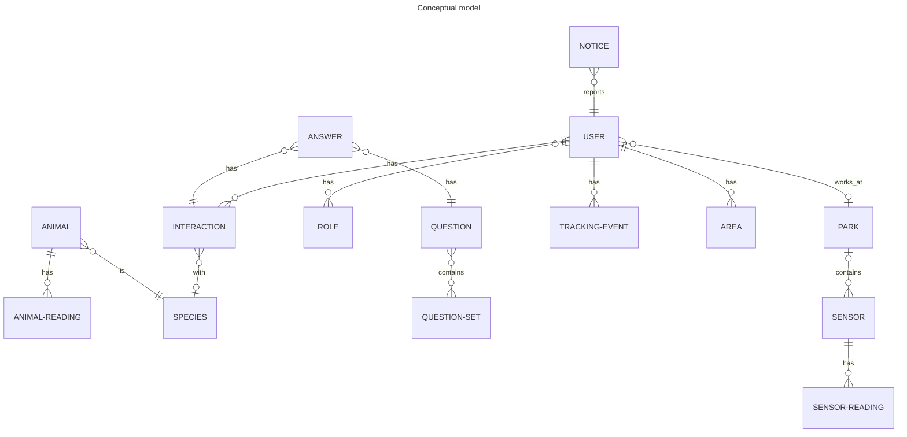

# wildlifenl

Project `wildlifenl` is the backend api for the WildlifeNL project.

## Concepts

`Animal` is a specific instance of an animal. For example: that one horse. Usually this implies that the animal in question carries a biosensor for uniqiue identification.

`Species` is a definition for a group of animals. For example: horses.

`User` is a human user of any role. The roles that the user has authorize him/her to more functionality. A user can also have no role, which referes to the most prohibited user types (Recreationist and Landowner).

`Interaction` is a report from the user about having had a human-wildlife interaction. This optionally includes the species of the animal.

`Tracking-Event` is a record of the position of the user at a certain moment in time. Often collected automatically and transparently.

`Role` is an authorization for a set of functionalities. A user having a certain role is authorized to call the functionalities associated with that role.

`Notice` is a report of something that is not normal and/or should be fixed. For example: something is damaged by animals or an animal was killed by a vehicle.

`Question-Set` is a predefined group of questions that a user should answer upon registering an interaction.

`Question` is a question that was asked the user upon registering an interaction.

`Answer` is the answer given for a question by the user upon registering an interaction.

`Area` is a place in the world with a specified boundary, that is of interest to a User, for example an agriculture field or a garden.

`Animal-Reading` is a record of the position of the animal at a certain moment in time, including optional fields for accelerometer and other sensors.

`Park` is a place in the world designated as a nature area, for example a living lab.

`Sensor` is a device at a location that produces readings, for example a visitor counter.

`Sensor-Reading` is a record of a sensor device placed at a certain location.

