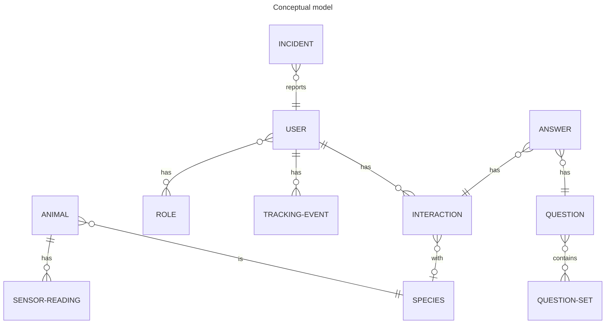

# wildlifenl

Project `wildlifenl` is the backend api for the WildlifeNL project.

## Concepts

`Animal` is a specific instance of an animal. For example: that one horse.

`Species` is a definition for a group of animals. For example: horses.

`User` is a human user of any role. The roles that the user has authorize them to more functionality. A user can also have no role, which means "Recreant".

`Interaction` is a report from the user about having had a human-wildlife interaction. This optionally includes the species of the animal.

`Tracking-Event` is a record of the position of the user at a certain moment in time. Often collected automatically and transparently.

`Sensor-Reading` is a record of the position of the animal at a certain moment in time, including optional fields for accelerometer and other sensors.

`Role` is an authorization for a set of functionalities. A user having a certain role is authorized to call the functionalities associated with that role.

`Incident` is a report of something that is anominal. For example: something is damaged by animals or an animal was killed by a vehicle.

`Answer` is the answer given for a question by the user upon registering an interaction.

`Question` is a question that was asked the user upon registering an interaction.

`Question-Set` is a predefined group of questions that a user should answer upon registering an interaction.

